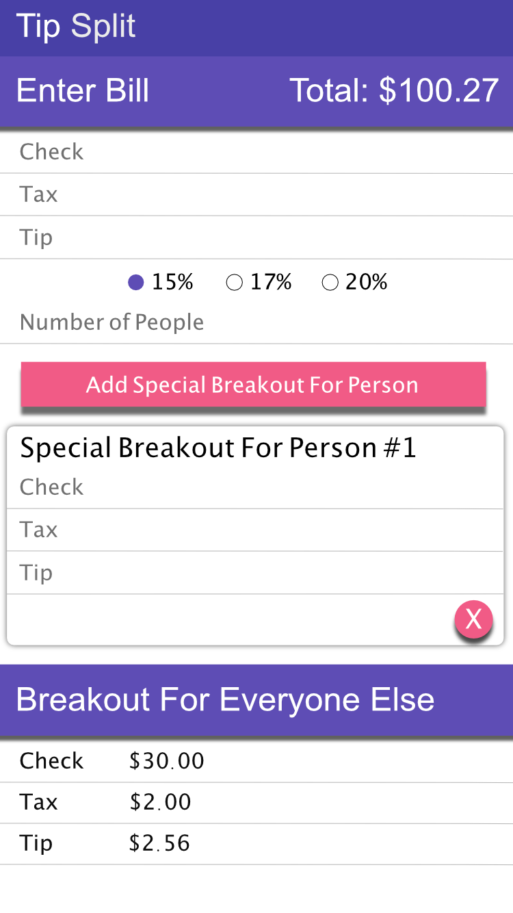

# Tip Split

## [Link to App hosted on Heroku](http://tipsplit.herokuapp.com)

## Comments on Project
I got more comfortable using Angular, modularizing my Angular parts into different files, and using custom directives. ```ng-include``` was super helpful in helping me avoid having one colossal html file.

## Description
A web application to split bills between friends.

## User Stories
  * A user will be able to enter the total bill and tax
  * A user will be able to choose their percentage of tip
  * A user will be able to enter how many people to split the bill with
  * A user will be able to round the bill
  * A user will be able to add customized numbers for a person (because they ordered something special), and then split the bill among the remaining people
  * A user will be able to see a reconciliation of the math and bill

## Wireframe
  Updated Wireframe
  
  
